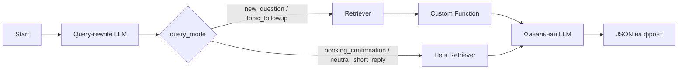

# План работ: current_topics (Вариант 1)

Понятный пошаговый план по усилению механики current_topics и коротких ответов в Flowise AgentFlow V2. Варианты 2 и 3 (primary_source, карта тем) в этот план не входят.

---

## 1. Цель и рамки

- **Цель:** усилить механику current_topics и обработку коротких ответов («да», «ок», «давай») по Варианту 1.
- **Сохраняем:** AgentFlow V2, Retriever, Custom Function, финальная LLM, query-rewrite нода, идея current_topics, существующую RAG-базу.
- **Не делаем сейчас:** primary_source по файлу (Вариант 2), карта тем (Вариант 3), смена стека, перенос логики в код «мимо» Flowise.

---

## 1.5. Архитектурные правила, которые нельзя нарушать

Этот блок задаёт рамки не только «что делать», но и «что не делать». Cursor и другие инструменты не должны выходить за эти границы.

**Запрещено:**

- Менять текущую архитектуру AgentFlow V2 (не переходить на Chatflow и не ломать цепочку нод).
- Убирать query-rewrite ноду перед Retriever.
- Переносить логику в новый стек или переписывать всё в код вне Flowise.
- Внедрять primary_source, file-level routing или карту тем (Варианты 2–3).
- Парсить человеческий текст ответа бота регулярками, если нужные данные можно получить из Structured Output / служебных полей.
- Использовать JSON-ответ фронту как основной механизм маршрутизации внутри потока (маршрутизация — по Flow State и query_mode).
- Отправлять в Retriever сырые короткие ответы вроде «да», «ок», «угу», «давайте» — только normalized_query по правилам ниже.

---

## 2. Два разных слоя в Flowise

### Flow State (память потока)

- Задаётся в **Start-ноде** (дефолты) и обновляется нодами по ходу диалога.
- Влияет на маршрутизацию, Retriever, выбор подтем, интерпретацию коротких ответов.
- **В Start задаём только state-ключи.** JSON-ответ LLM в Start не инициализируем.

### JSON Structured Output (ответ наружу)

- Схема задаётся только в настройке **финальной LLM-ноды**.
- Ключи: `answer`, `ui_ctaIntent`, `meta_stage`, `meta_confidence`, `flags_emotional`, `leadIntent`, `meta_shouldHandoff`.
- LLM каждый раз генерирует новый JSON для фронта. Эти поля не используются для маршрутизации внутри потока.

| Где | Что |
|-----|-----|
| **Start-нода** | current_topics, covered_topics, last_offered_topic, last_offer_type, has_retrieved_content, has_current_topics, query_mode, normalized_query |
| **Финальная LLM-нода (схема ответа)** | answer, ui_ctaIntent, meta_stage, meta_confidence, flags_emotional, leadIntent, meta_shouldHandoff (+ служебные поля для state — см. раздел 7) |

### 2.5. Упрощённая модель state: ядро и результат шага

Чтобы не перегружаться, не держать в голове все поля как «огромный список». State удобно делить на две части.

**Ядро (память между шагами)** — то, без чего следующий шаг не поймёт контекст:

- **last_offered_topic**, **last_offer_type** — что бот последним предложил и какого типа.
- **covered_topics** — что уже раскрыли по текущей теме.
- **query_mode**, **normalized_query** — как интерпретировали текущую реплику и что пошло (или пойдёт) в Retriever.

**Результат текущего retrieval-шага** — не «долгоживущая память», а рабочая область шага. Пересчитывается после Retriever + Custom Function каждый раз:

- **has_retrieved_content**, **has_current_topics** — технические флаги: нашли контент или нет, есть ли подтемы. Нужны для логики ответа, но не требуют сложной mental model.
- **current_topics** — все подтемы из выдачи; это **результат Custom Function**, а не «ещё одна вечная сущность».
- **available_topics** — считается на лету (current_topics − covered_topics), в state не храним.

**Две оси:**

1. **Что имел в виду пользователь?** — решает query-rewrite: новый вопрос / согласие на подтему / согласие на запись / нейтральный короткий ответ. Поля: query_mode, normalized_query.
2. **Что у нас есть по теме?** — решает Retriever + Custom Function: нашли контент или нет, есть ли подтемы, что ещё не раскрыто. Поля: current_topics, covered_topics, available_topics.

**Три вопроса, к которым сводится механика:**

1. Что имел в виду пользователь? → query_mode.
2. Что мы нашли по теме? → current_topics (и флаги has_*).
3. Что уже обсудили? → covered_topics.

**Блоки для навигации:**

- **Блок A. Что бот предлагал:** last_offered_topic, last_offer_type.
- **Блок B. Что нашлось в текущей теме:** current_topics, available_topics (результат шага).
- **Блок C. Что уже раскрыли:** covered_topics.
- **Блок D. Что делать с текущей репликой:** query_mode, normalized_query.

Помнить только то, что нужно между шагами; всё вычисляемое — на лету; не превращать каждый технический флаг в отдельную «огромную сущность».

---

## 3. Схема потока

- **Читают/пишут Flow State:** Start (инициализация), Query-rewrite (читает last_offered_topic, last_offer_type; пишет normalized_query, query_mode), Custom Function (пишет current_topics, has_retrieved_content, has_current_topics), постобработка после финальной LLM (пишет last_offered_topic, last_offer_type, covered_topics).
- **Ветка по query_mode:** при `booking_confirmation` или `neutral_short_reply` Retriever не вызывается; поток идёт к финальной LLM без нового RAG-контекста (или с нейтральным сценарием).

---

## 4. Ключи Flow State: что задать в Start-ноде

### 4.1. Форматы полей (жёстко зафиксированы)

**Ядро (память между шагами):**

- **last_offered_topic** — строка (ярлык подтемы или пусто). Дефолт: `""`.
- **last_offer_type** — одно из: `topic_followup` | `booking` | `general`. Дефолт: `"general"` (уменьшает количество проверок на пустое значение).
- **covered_topics** — массив строк. Дефолт: `[]`.
- **query_mode** — одно из: `new_question` | `topic_followup` | `booking_confirmation` | `neutral_short_reply`. Дефолт: `"new_question"`.
- **normalized_query** — строка. Дефолт: `""`.

**Результат текущего шага** (перезаписываются после Retriever + Custom Function; в Start задаём только дефолты для первого прохода):

- **current_topics** — **массив строк.** Не строка через запятую. Пример: `["почему не больно", "как проходит операция"]`. Дефолт: `[]`. Смысл: результат Custom Function на этом шаге, а не «память всей сессии».
- **has_retrieved_content** — boolean. Дефолт: `false`. Технический флаг: нашли контент / не нашли.
- **has_current_topics** — boolean. Дефолт: `false`. Технический флаг: есть подтемы / нет.

**В Start не задаём:** answer, ui_ctaIntent, meta_stage, meta_confidence, flags_emotional, leadIntent, meta_shouldHandoff — это выход финальной LLM для фронта.

### 4.2. current_topics и available_topics (обязательное разведение)

- **current_topics** — все подтемы, извлечённые из retrieved content (Custom Function). Храним в state как массив строк.
- **covered_topics** — подтемы, которые уже были раскрыты в рамках текущей темы. Массив строк.
- **available_topics** — вычисляемый список, не храним отдельно в state:
  - `available_topics = current_topics − covered_topics`
- **Где считается:** available_topics вычисляется **в Custom Function** и передаётся в финальную LLM как часть контекста. Иначе появятся несколько версий логики.
- **Важно:** в финальную LLM передаём и используем для предложений «рассказать подробнее» именно **available_topics**, а не current_topics. Иначе модель будет предлагать уже раскрытые подтемы. В логах и промпте однозначно использовать термин available_topics для «что ещё доступно».

---

## 5. Этапы работ по порядку

1. **Добавить в Start** все state-поля из раздела 4 с дефолтами. Проверить, что state сохраняется между шагами и не затирается.
2. **Переписать query-rewrite ноду:** вход — question, last_offered_topic, last_offer_type; выход — строго JSON: `normalized_query`, `query_mode`. Правило коротких ответов — см. раздел 5.6.
3. **Маршрутизация по query_mode:** при `booking_confirmation` и `neutral_short_reply` не вызывать Retriever. Поведение neutral_short_reply — см. раздел 6.2.
4. **Расширить Custom Function:** выставлять has_retrieved_content, has_current_topics; хранить current_topics как массив строк; **вычислять здесь же** available_topics = current_topics − covered_topics и передавать available_topics в финальную LLM как часть контекста.
5. **Обновить промпт финальной LLM:** сценарии A/B/C по has_retrieved_content и has_current_topics; в промпте и контексте использовать available_topics (не current_topics) для предложения следующей подтемы.
6. **После ответа финальной LLM** обновлять last_offered_topic и last_offer_type в state. **Не извлекать эти значения из свободного текста ответа.** Получать их из Structured Output / служебных полей финальной LLM (см. раздел 7).
7. **Вести covered_topics:** при реальном раскрытии подтемы добавлять её в covered_topics. Не считать раскрытием «мельком упомянул» или «перечислил в списке». Критерий: подтема явно развернута в ответе (смысловой блок про неё). Источник для добавления в covered_topics — служебное поле из финальной LLM, а не парсинг текста. **Где обновлять:** обновление covered_topics выполняется **после ответа финальной LLM, в пост-обработке шага** (отдельная нода или скрипт после LLM), а не внутри самой LLM-ноды.
8. **Правило сброса / обновления topic-state** — см. раздел 5.8.
9. **Логирование** (рекомендовано): question, normalized_query, query_mode, last_offered_topic, last_offer_type, has_retrieved_content, has_current_topics, current_topics, covered_topics, available_topics, ответ финальной LLM.
10. **QA:** прогнать сценарии из qa-test-cases.md и 2–3 кейса под current_topics и короткие ответы.

### 5.6. Короткие ответы: по контексту оффера, не по словарю

Слова «да», «ок», «хорошо», «давайте», «хочу», «расскажите», «подробнее», «ага», «угу» **не классифицируются только по слову.** Интерпретация зависит от **last_offer_type**:

- Если **last_offer_type = topic_followup** → трактуем как согласие продолжить подтему: `query_mode = topic_followup`, **normalized_query = last_offered_topic** (в Retriever уходит именно эта тема, а не сырое «да»).
- Если **last_offer_type = booking** → трактуем как согласие на запись: `query_mode = booking_confirmation`, `normalized_query = ""`.
- Иначе → `query_mode = neutral_short_reply`, `normalized_query = ""`.

В промпте query-rewrite ноды явно прописать: не использовать жёсткий словарь слов; всегда смотреть на last_offer_type.

### 5.8. Правило сброса / обновления topic-state

- **last_offered_topic** и **last_offer_type** обновляются после каждого нового ответа бота (из служебных полей финальной LLM).
- **covered_topics** ведётся в рамках текущей активной deep-темы, а не всей сессии подряд.
- **Смена темы — когда очищать covered_topics:** не строить «мини-ИИ» для распознавания смены темы. Достаточно простого правила: если **query_mode = new_question** и Retriever вернул **другой набор current_topics** (по сравнению с предыдущим шагом) → очищаем covered_topics. last_offered_topic и last_offer_type при этом обновятся сами из следующего ответа бота.

---

## 6. Ветки по query_mode

### 6.1. new_question, topic_followup

- Передаём normalized_query в Retriever. Дальше Custom Function → финальная LLM с контекстом и available_topics.

### 6.2. neutral_short_reply — что делает бот

- **Не** запускает новый RAG-поиск.
- **Не** продолжает предыдущую медицинскую тему самовольно (финальная LLM не должна получать старый RAG-контекст как основной и развивать тему без запроса).
- Отвечает коротко и нейтрально.
- Максимум — один мягкий вопрос или нейтральное завершение («Чем ещё могу помочь?» и т.п.).

При реализации следить, чтобы при neutral_short_reply финальная LLM не получала полный предыдущий контекст темы и не продолжала его по своей инициативе.

### 6.3. booking_confirmation

- Retriever не вызывается. Поток переходит в механику записи (сбор имени/телефона, lead flow).

---

## 7. Служебные поля финальной LLM для обновления state

Чтобы не парсить текст ответа бота, финальная LLM помимо answer и UI-полей должна возвращать **служебные поля** для внутренней логики потока:

- **offered_topic_label** — ярлык подтемы, которую бот только что предложил продолжить (или пусто).
- **offer_type** — тип последнего предложения: `topic_followup` | `booking` | `general`.
- **covered_topic_label** — ярлык подтемы, которую бот в этом ответе реально раскрыл (или пусто, если не раскрывал новую).

Эти поля используются **только для обновления Flow State** (last_offered_topic, last_offer_type, добавление в covered_topics). Их не путать с UI-JSON для фронта: можно держать в том же JSON-ответе, но семантически они для потока, а не для виджета. Тогда Cursor и реализация не будут извлекать last_offered_topic из текста answer регулярками.

---

## 8. Чек-лист для самопроверки

- [ ] В Start заданы только state-ключи; JSON-ключи ответа (answer, ui_ctaIntent, …) в Start не задаются.
- [ ] Query-rewrite возвращает JSON; короткие ответы не отправляются в Retriever как «да»/«ок».
- [ ] Короткие ответы (ок, хочу, давайте) интерпретируются через **last_offer_type**, а не через жёсткий словарь слов.
- [ ] Custom Function выставляет has_retrieved_content, has_current_topics; current_topics — массив строк; считается available_topics = current_topics − covered_topics.
- [ ] В финальную LLM передаётся **available_topics**, а не полный current_topics.
- [ ] Промпт различает три сценария по has_retrieved_content / has_current_topics (нет контента / контент без подтем / есть подтемы).
- [ ] last_offered_topic и last_offer_type обновляются после ответа из **служебных полей** Structured Output, а не из парсинга текста.
- [ ] covered_topics не раздувается от «мельком упомянул»; при смене темы допускается сброс covered_topics.
- [ ] При neutral_short_reply бот не продолжает медицинскую тему самовольно и не тянет старый RAG-контекст как основной.

---

## 9. Связанные документы

- [info/flowise.md](flowise.md) — структура потока и P0
- [info/current-topics-mechanics.md](current-topics-mechanics.md) — механика current_topics
- [info/temp.md](temp.md) — детальный чек-лист по этапам
- [info/prompt.md](prompt.md) — системный промпт и §14 (JSON-схема)
- [info/qa-test-cases.md](qa-test-cases.md) — тест-кейсы
